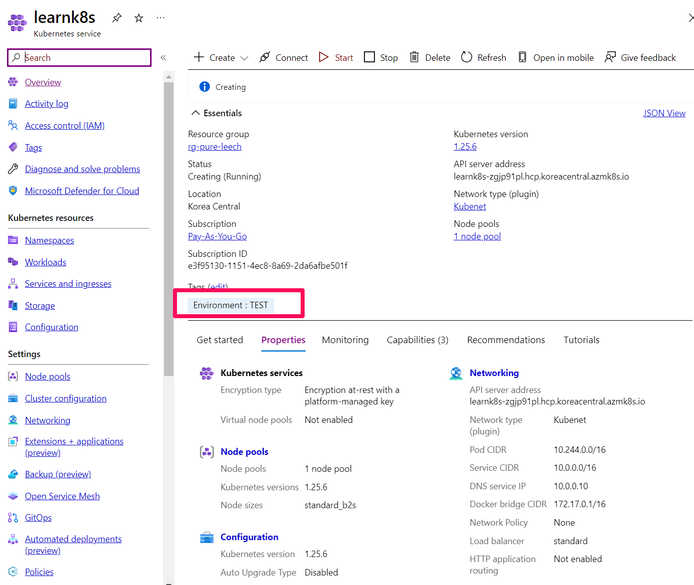
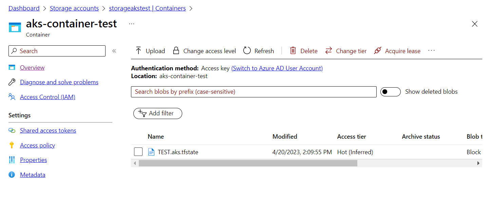
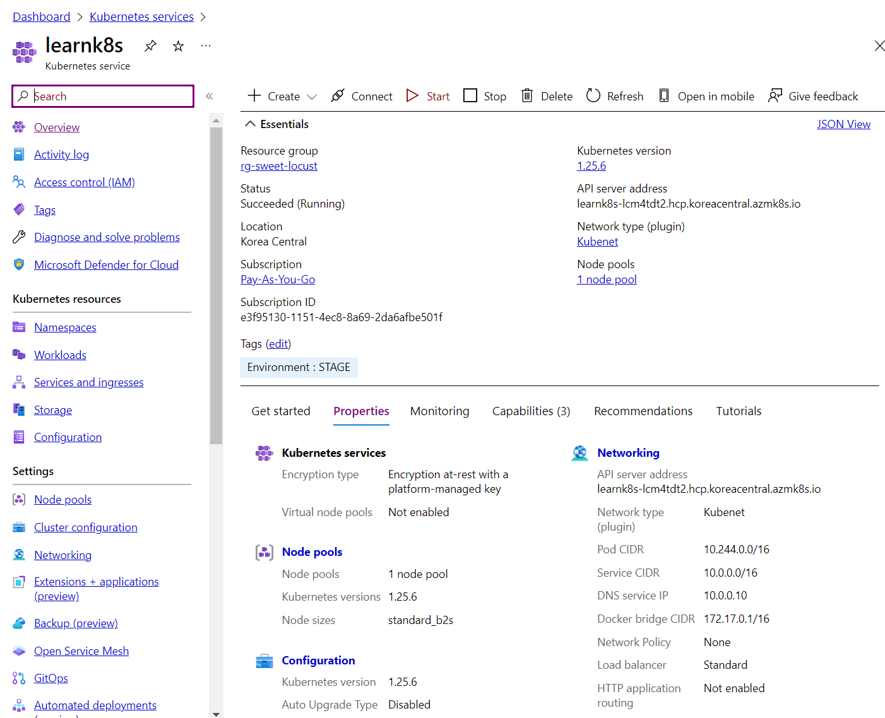
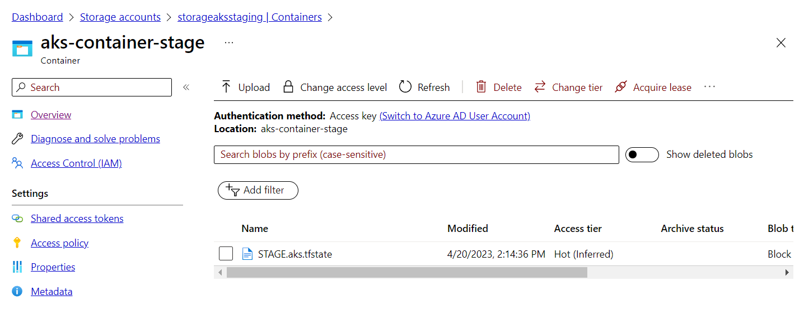

# Create Infrastructure AKS using Terraform
    + Create infrastructure Azure Kubernetes Service using Terraform
    + Using GitHub Actions
        + Run Terraform
        + Push terraform state file to Azure Storage.

### Requisite
    + Install azure cli

### Using Terraform in Azure
+ Azure Login
    ```
    az login
    ```

+ Create group in Azure
    ```
    az ad sp create-for-rbac --name "myAKS" --role contributor --scopes /subscriptions/<SUBSCRIPTION_ID>
    ```
    Copy and paste appId and password into Secret GitHub with AZURE_AD_CLIENT_ID, AZURE_AD_CLIENT_SECRET and AZURE_AD_TENANT_ID respectively

+ Create storage accounts in Azure
    ```
    # Create Storage Account
    az storage account create -n storageakstest -g containers -l koreacentral --sku Standard_LRS

    # Create Storage Account Container
    az storage container create -n aks-container-test --account-name storageakstest --auth-mode login
    ```

+ Add secret values into Secret GitHub
    ```
    AZURE_AD_CLIENT_ID
    AZURE_AD_CLIENT_SECRET
    AZURE_SUBSCRIPTION_ID
    AZURE_AD_TENANT_ID
    ```

### Result








### References
+ [AKS Application Gateway Ingress](https://learn.microsoft.com/en-us/azure/developer/terraform/create-k8s-cluster-with-aks-applicationgateway-ingress)
+ [Fix RoleAssignment](https://learn.microsoft.com/en-us/answers/questions/287573/authorization-failed-when-when-writing-a-roleassig)